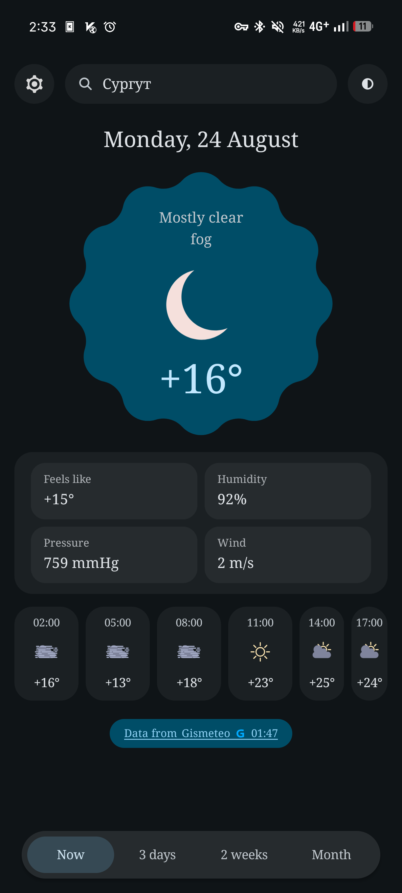

# GisWrap

A customizable Android weather app powered by Gismeteo, built with Material You / MD3E.

Search a city, then read current conditions and the 3-day, 2-week and month
forecasts. A home-screen widget shows the primary city. It talks to gismeteo.ru
directly — no server in between, no account, no API key.

Available in English and Russian, following your system language by default.

<!-- Drop now.png into docs/screenshots/ and this renders. -->

## Key Features

- **Deep customization** — accent colour, typeface, text metrics, panel shapes and widget styling, all live
- **Home-screen widget** that follows your theme, with adjustable shape, outline and opacity
- **Four forecast ranges** — now, 3 days, 2 weeks and a month, each on its own swipeable page
- **Pick-me theme** — hand-drawn icons, scalloped panels and a starry sky, with its own set of dials
- **Your own background** image behind the interface, instead of the star field
- **Material You dynamic colour** from your wallpaper, or a colour you pick yourself in an HCT picker
- **Saved cities** with one marked primary — it opens at launch and feeds the widget
- **Use my location** — geocodes a fix and picks the *nearest* matching city, not the first
- **English and Russian**, switchable in-app or left to follow the system
- **Offline-tolerant** — forecasts are cached in Room and shown while a refresh runs
- **No accounts, no telemetry, no ads** — the app has no backend of its own

## Customization

Nearly everything you can see is adjustable, and every change applies immediately:

- **Colour** — dynamic colour from your wallpaper, or your own accent chosen by hue and saturation
- **Type** — system, serif or Rubik Doodle Shadow, with size, weight, line and letter spacing on one set of sliders that move every label at once
- **Shape** — edge waviness, wave frequency, how hand-drawn the outline is, and star size
- **Widget** — outline on or off, panel opacity, and whether it mirrors the main weather block's shape
- **Background** — your own image, or the drawn night sky

## Installation

Grab the APK from [Releases](https://github.com/cyberrin/giswrap/releases), or
build it yourself — see [Building](docs/BUILDING.md).

Sideloading shows an "unknown app" prompt on first install. That is expected for
anything not distributed through Play.

## Minimum requirements

- Android 8.0 Oreo (API 26) or later
- Built against API 37, tested on arm64

## Building from Source

See [docs/BUILDING.md](docs/BUILDING.md) — it covers the toolchain pins, the two
different JDK settings, and release signing.

## How it works

See [docs/ARCHITECTURE.md](docs/ARCHITECTURE.md) for the layout, the stack, how
the Python fetcher maps onto Kotlin, and the known gaps.

## Links

- Upstream data — [gismeteo.ru](https://www.gismeteo.ru)

## Contributing

Issues and pull requests are welcome. Run `./gradlew :app:testDebugUnitTest`
before opening one — 162 tests, no device or network needed.
